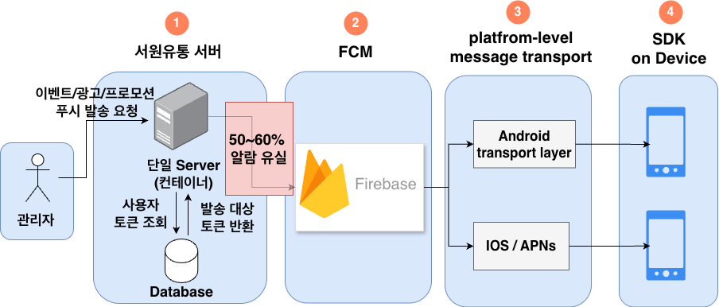
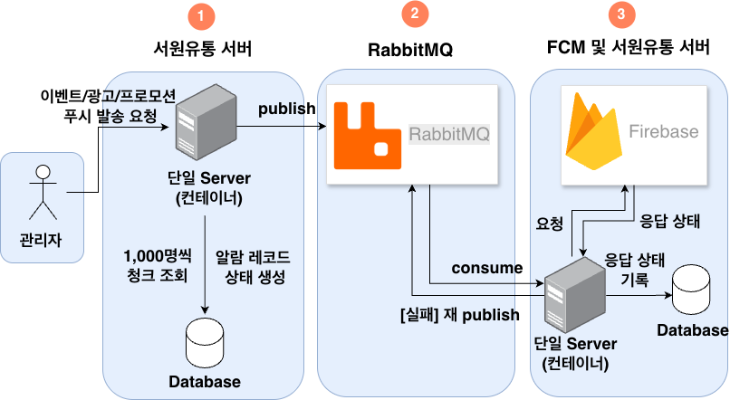

# 서원유통 대용량 푸시 알림 시스템 개선 프로젝트

## 1. 프로젝트 소개

서원유통 탑마트 앱의 **대용량 푸시 알림 발송 시스템을 개선**하는 백엔드 프로젝트입니다.

이벤트·광고·프로모션 알림을 약 10만 명의 사용자에게 안정적으로 전달하기 위해, 기존 단일 서버 구조에서 발생하던 알림 유실 문제를 메시지 큐(RabbitMQ) 기반 비동기 아키텍처로 해결하는 것을 목표로 합니다.


## 2. 기술 스택

- **Backend** : Spring Boot, Java
- **Message Queue** : RabbitMQ
- **Push Notification** : FCM (Firebase Cloud Messaging)
- **Monitoring** : Spring Boot Actuator, Micrometer, Prometheus, Grafana
- **Database** : MySQL (Spring Data JPA)

## 3. 문제 상황: 대용량 푸시 알림 발송 시 알림 유실 발생

서원유통 탑마트 앱은 이벤트, 광고, 프로모션 정보를 사용자에게 전달하기 위해 FCM 기반 푸시 알림을 사용하고 있었습니다. 하지만, 약 10만 건 규모의 이벤트성 푸시 알림을 발송하는 과정에서 서버가 FCM으로 알림을 전달하는 시점에 병목이 발생했고, 그 결과 **50~60% 이상의 알림이 유실**되는 문제가 발생했습니다.

기존 구조의 아키텍처와 문제점은 다음과 같았습니다.



> **기존 플로우**
> 1. 관리자가 푸시 발송 요청
> 2. 단일 서버가 DB에서 사용자 토큰을 조회 후 FCM에 직접 전달
> 3. FCM → Android / iOS 디바이스로 전달
>
> **문제점** : 단일 서버가 10만 건의 FCM 요청을 동기적으로 처리하면서 병목이 발생, 50~60% 이상의 알림 유실

## 4. 문제 인식 및 개선 방향

이 문제는 단순히 푸시 알림 기능의 오류가 아니라, **이커머스 서비스의 마케팅 성과와 사용자 경험에 직접적인 영향을 주는 문제**라고 판단했습니다. 할인 정보, 이벤트 알림, 쿠폰 안내와 같은 메시지가 정상적으로 전달되지 않으면 사용자는 혜택을 놓치게 되고, 서비스 입장에서는 구매 전환 기회를 잃게 됩니다.

운영 현황과 제안서 내용을 기반으로 분석했을 때, 핵심 문제는 **서버가 대량의 푸시 알림 요청을 한 번에 처리하고 FCM으로 직접 발송하는 구조**에 있다고 판단했습니다. 이를 해결하기 위해 다음 두 가지 방향을 제안했습니다.

### 4.1 청크 단위 데이터 처리

10만 명의 사용자 토큰을 한 번에 조회해 메모리에 올리면 DB와 서버에 큰 부하가 발생합니다. 이를 해결하기 위해 **1,000명 단위로 나누어 조회하는 방식**을 제안했습니다.

- 전체 10만 명을 1,000명씩 100번 나누어 조회
- 한 번에 메모리에 올리는 데이터 양을 최소화
- 중간에 실패가 발생하더라도 어느 배치까지 처리되었는지 기준으로 재처리 가능

### 4.2 메시지 큐를 통한 역할 분리

기존 구조는 API 서버가 FCM을 직접 대량 호출하기 때문에, 대규모 발송 시 서버 부하가 급격히 증가합니다. 이를 개선하기 위해 **API 서버와 알림 발송 서버의 역할을 분리**하는 구조를 제안했습니다.

| 역할 | 담당 |
|------|------|
| 알림 요청을 메시지 큐에 적재 | API 서버 |
| 큐에서 메시지를 소비해 FCM으로 전달 | 알림 발송 처리 서버 |

이 구조를 적용하면:
- API 서버는 대량 발송 요청을 빠르게 큐에 적재하고 즉시 응답 가능
- 알림 발송 서버는 큐에서 메시지를 하나씩 가져와 FCM으로 안정적으로 전달
- 처리 완료된 메시지는 ACK 처리, 실패한 메시지는 재시도 또는 실패 큐로 분리 가능


## 4.3 메시지 큐 도입 방향으로 정리한 이유

개선 방향을 검토하는 과정에서 배치 처리만으로도 어느 정도 복구가 가능하다는 점을 확인했습니다. 1,000명 단위로 발송하고 마지막으로 처리한 배치 번호나 사용자 ID를 DB에 저장하면, 서버 장애 이후 해당 구간부터 다시 발송하는 구조를 만들 수 있습니다.

다만 이 방식만으로는 대용량 푸시 알림 유실 문제를 안정적으로 해결하기 어렵다고 판단했고, 전무님·상무님과의 논의를 통해 **단순히 10만 건을 나누어 처리하는 것보다, 발송 요청 하나하나의 처리 상태를 어떻게 관리할지가 더 중요하다**는 방향으로 의견을 정리했습니다.

### 4.4 배치 처리만 사용할 경우의 한계

배치 처리만 사용하면 발송 상태 관리를 애플리케이션에서 직접 구현해야 합니다. 1,000명 단위 배치 중 일부는 성공, 일부는 FCM 요청 실패, 나머지는 아직 미처리 상태가 될 수 있는데, "몇 번째 배치까지 처리했다"는 정보만으로는 어떤 알림을 다시 보내야 하는지 정확히 판단하기 어렵습니다.

결국 배치 방식만 사용하면 다음 모든 상황을 애플리케이션이 직접 관리해야 합니다.

- 어떤 사용자에게 알림을 보냈고, 어떤 사용자는 실패했는지
- FCM 요청은 보냈지만 응답을 받기 전에 서버 장애가 발생한 경우
- 재발송 시 중복 발송을 어떻게 방지할지

### 4.5 메시지 큐가 더 적합한 이유

메시지 큐를 사용하면 발송 요청을 **개별 메시지 단위**로 Queue에 적재할 수 있습니다.

1. API 서버는 사용자 토큰을 청크 단위로 조회한 뒤, FCM을 직접 호출하지 않고 "누구에게 어떤 알림을 보낼지"를 메시지로 만들어 큐에 저장
2. 큐를 구독하는 알림 발송 처리 서버가 메시지를 가져와 FCM으로 전달
3. 처리 완료된 메시지만 ACK 처리 → ACK가 전달되지 않은 메시지는 완료로 간주되지 않아 재처리 대상으로 유지

> 메시지 큐는 장애 자체를 없애는 기술이 아니라, **장애가 발생했을 때 어떤 요청이 처리되었고 어떤 요청이 다시 처리되어야 하는지를 메시지 단위로 관리**할 수 있게 해주는 구조입니다.

전무님·상무님께서도 대용량 푸시 발송에서는 단순 배치 처리보다 발송 요청을 안정적으로 적재하고 실패한 요청을 재처리할 수 있는 구조가 필요하다는 점을 말씀해주셨습니다.

이에 따라 **청크 처리는 DB 조회와 메모리 부하를 줄이는 보조 전략**으로, **실제 발송 요청은 메시지 큐에 적재해 성공·실패·재시도 여부를 개별 메시지 단위로 관리**하는 방향으로 정리했습니다.

결론적으로 메시지 큐 도입은 단순히 발송 속도를 높이기 위한 선택이 아니라, 대용량 푸시 발송 과정에서 발생할 수 있는 **알림 유실, 실패 재처리, 중복 발송 관리, 장애 복구 문제를 더 안정적으로 다루기 위한 선택**이었습니다.

## 5. Kafka vs RabbitMQ — RabbitMQ를 선택한 이유

메시지 큐 도입을 검토하면서 Kafka와 RabbitMQ를 함께 비교했습니다. 두 기술 모두 메시지를 비동기적으로 처리할 수 있지만, 설계 목적과 적합한 사용 사례에는 차이가 있습니다.

### 5.1 Kafka

대규모 **이벤트 스트리밍 플랫폼**에 가깝습니다. 메시지를 전달하고 삭제하는 구조가 아니라, 이벤트 로그를 Topic에 저장하고 Consumer가 Offset을 기준으로 읽어가는 구조입니다. 주문 이벤트·클릭 로그·사용자 행동 데이터처럼 대량의 이벤트를 장기간 저장하고, 여러 시스템이 같은 데이터를 반복해서 읽어야 하는 경우에 강점이 있습니다.

### 5.2 RabbitMQ

**작업 큐 기반 메시징 시스템**에 더 가깝습니다. Producer가 메시지를 Queue에 넣으면 Consumer가 가져가 처리하고, 완료 시 ACK를 보내는 방식입니다. 처리 완료 여부가 명확하고, 실패 시 재시도하거나 Dead Letter Queue로 분리하는 구조를 직관적으로 설계할 수 있습니다.

### 5.3 이번 문제에 RabbitMQ가 더 적합했던 이유

이번 문제의 핵심은 이벤트 로그를 장기간 저장하거나 여러 시스템이 같은 이벤트를 반복 소비하는 것이 아니었습니다. **10만 건의 푸시 알림 요청을 유실 없이 적재하고, FCM으로 안정적으로 발송하며, 실패한 요청을 재처리하는 구조**를 만드는 것이 핵심이었습니다.

푸시 알림 발송은 "A 사용자에게 이벤트 알림을 보낸다"처럼 개별 발송 작업을 처리하는 성격이 강합니다. 즉, 이벤트 스트리밍보다는 **작업 큐에 가까운 문제**였습니다.

Kafka를 사용할 경우 Topic·Partition·Consumer Group·Offset 관리를 함께 설계해야 하며, "FCM 발송 실패 시 재시도, 반복 실패 시 실패 큐로 분리"라는 요구사항을 구현하려면 추가적인 설계가 필요합니다. 반면 RabbitMQ는 ACK·Retry·Dead Letter Queue 구조가 이 요구사항에 직관적으로 대응됩니다.

| 구분 | Kafka | RabbitMQ |
|------|-------|----------|
| 성격 | 이벤트 스트리밍 플랫폼 | 작업 큐 기반 메시징 시스템 |
| 메시지 저장 | Topic에 이벤트 로그 형태로 저장 | Queue에 작업 메시지 형태로 저장 |
| 소비 방식 | Consumer가 Offset 기준으로 읽음 | Consumer가 메시지를 가져가 처리 후 ACK |
| 강점 | 대량 이벤트 처리, 로그 적재, 데이터 파이프라인 | 작업 분배, 처리 완료 확인, 재시도, 실패 큐 |
| 적합한 예시 | 주문 이벤트 스트림, 클릭 로그, 추천/통계용 이벤트 수집 | 이메일 발송, 푸시 알림 발송, 이미지 처리 작업 |
| 실패 처리 | Offset 관리와 별도 재처리 설계 필요 | ACK, Retry, Dead Letter Queue 구성이 직관적 |
| 이번 문제와의 적합성 | 대규모 이벤트 분석 목적이라면 적합 | 푸시 발송 작업 처리에 더 적합 |

결론적으로 서원유통 탑마트 앱의 대용량 푸시 알림 문제는 이벤트 스트리밍보다 **작업 큐 기반 비동기 처리**에 가까웠습니다. 따라서 사용자 토큰을 청크 단위로 조회하고, 발송 요청을 RabbitMQ Queue에 적재한 뒤, 큐를 구독하는 알림 발송 처리 서버가 FCM으로 전달하는 구조가 더 적합하다고 판단했습니다.

## 6. 구현 구조 및 테스트 방법

실제 FCM 연동 없이 구조를 검증하기 위해 두 개의 Spring Boot 서버로 나누어 구현했습니다.

- **`main` 서버 (8080포트)** → 서원유통 서버 역할
- **`mocksever` 서버 (8081포트)** → FCM 서버 역할 (Mock)

### 6.1 전체 플로우



```
① 서원유통 서버 (Producer)
   관리자 요청 → 1,000명씩 청크 조회
              → AlarmSend 레코드 생성 (status=READY)
              → RabbitMQ alarm.queue에 publish (alarmSendId|memberId|message)

② RabbitMQ
   alarm.queue (durable) — 메시지 보관

③ 서원유통 서버 (Consumer) + FCM
   consume → FCM(Mock 서버)에 HTTP POST 요청
          → 응답 성공 : alarm_send.status = SENT
          → 응답 실패 : alarm_send.status = FAILED + lastErrorCode 기록
          → 실패 시 RabbitMQ에 재 publish
```

> ①과 ③은 현재 코드에서 같은 서버(main 8080)가 담당하며, 향후 Consumer 서버를 분리하는 확장이 가능한 구조입니다.

### 6.2 main 서버 주요 구성

| 클래스 | 역할 |
|--------|------|
| `RabbitTestController` | `/send-test` 요청을 받아 DB에서 1,000명 단위 청크 조회 후 큐에 적재 |
| `AlarmSender` | `memberId\|message` 형식으로 RabbitMQ `alarm.queue`에 publish |
| `AlarmListener` | 큐를 구독하며 메시지 소비 → Mock 서버에 HTTP POST 호출 |
| `RabbitConfig` | `alarm.queue`를 durable 큐로 선언 (서버 재시작 후에도 큐 유지) |

### 6.3 Mock 서버 주요 구성

| 클래스 | 역할 |
|--------|------|
| `MockPushController` | `POST /mock/nhn/push` 요청을 받아 90% 성공 / 10% 실패를 랜덤으로 반환 |

실제 FCM은 외부 서비스이므로 직접 연동 대신 Mock 서버로 대체하여, 대량 발송 시 성공·실패 흐름과 RabbitMQ를 통한 메시지 처리 구조를 검증했습니다.


## 7. DB 설계 및 재시도 처리 전략

### 7.1 DB 설계

단순히 메시지를 큐에 적재하는 것만으로는 "어떤 사용자에게 알림이 성공했고, 어떤 사용자는 실패했는지"를 추적할 수 없습니다. 이를 해결하기 위해 발송 요청 단위로 상태를 관리하는 `alarm_send` 테이블을 설계했습니다.

**테이블 구성**

| 테이블 | 컬럼 | 설명 |
|--------|------|------|
| `member` | id, name | 사용자 정보 |
| `alarm` | id, content | 알림 내용 |
| `alarm_send` | id, member_id(FK), alarm_id(FK), status, lastErrorCode | 사용자별 발송 상태 추적 |

**`alarm_send.status` — `SendStatus` Enum**

| 값 | 의미 |
|----|------|
| `READY` | 발송 대기 (아직 처리되지 않음) |
| `SENT` | FCM 발송 성공 |
| `FAILED` | FCM 발송 실패 |

`lastErrorCode` 컬럼에는 Mock 서버(FCM)로부터 받은 실패 코드(예: `MOCK_FAIL`, `HTTP_ERROR`)를 기록하여 실패 원인을 추적할 수 있도록 설계했습니다.

### 7.2 재시도 처리 전략

`AlarmListener`에서 Mock 서버 응답 결과에 따라 다음과 같이 처리하도록 설계했습니다.

```
FCM(Mock 서버) 응답 성공
  → alarm_send.status = SENT

FCM(Mock 서버) 응답 실패 (errorCode 반환)
  → alarm_send.status = FAILED
  → alarm_send.lastErrorCode = errorCode (예: MOCK_FAIL)

HTTP 예외 발생 (서버 장애, 타임아웃 등)
  → alarm_send.status = FAILED
  → alarm_send.lastErrorCode = HTTP_ERROR
```

이 구조를 통해 `FAILED` 상태인 레코드만 재조회하여 재발송하거나, `lastErrorCode` 기준으로 실패 유형을 분류해 원인을 파악하는 흐름을 만들 수 있습니다.

> `AlarmListener`에서 Mock 서버 응답 결과에 따라 `alarm_send` 테이블의 상태를 실제로 업데이트하며, 발송 성공·실패 건수는 Micrometer 메트릭(`alarm.consume.success`, `alarm.consume.fail`)으로도 함께 확인할 수 있습니다.


## 8. RabbitMQ 장애 대응

RabbitMQ가 다운되었을 때 발생할 수 있는 메시지 유실은 두 가지 유형으로 구분했습니다.

| 유형 | 상황 | 담당 |
|------|------|------|
| 1. 아직 큐에 넣지 못한 메시지 유실 | 서버가 publish 시도 중 RabbitMQ 다운 | 서원유통 백엔드 단에서 별도 조정 필요 |
| 2. 큐 안에 있던 메시지 유실 | RabbitMQ 재시작 시 메모리의 메시지 소멸 | RabbitMQ 자체 내구성 옵션으로 해결 |

2번 유형에 대해 RabbitMQ 자체 내구성 옵션을 적용하여 해결했습니다.

### 8.1 구현한 방안

**Durable Queue**

큐를 durable로 선언하여 RabbitMQ가 재시작되더라도 큐 자체가 사라지지 않도록 설정했습니다.

```java
// RabbitConfig.java
new Queue(QUEUE_NAME, true)  // durable = true
```

**Persistent Message**

Spring AMQP의 `RabbitTemplate`은 기본 delivery mode가 `PERSISTENT`로 설정되어 있습니다. 별도 설정 없이도 큐에 적재되는 메시지가 디스크에 함께 기록되어, RabbitMQ 재시작 후에도 메시지가 보존됩니다.

### 8.2 추가 개선 방향

**Publisher Confirm**

현재는 `AlarmSender`가 `rabbitTemplate.convertAndSend()` 호출 후 RabbitMQ가 실제로 메시지를 받았는지 확인하지 않습니다. Publisher Confirm을 설정하면 Spring Boot가 publish 후 RabbitMQ로부터 수신 확인 응답을 받아야만 성공으로 간주하도록 할 수 있습니다. 이를 통해 ①번 유형(큐에 넣지 못한 메시지)의 유실도 애플리케이션 레벨에서 감지할 수 있습니다.

```properties
spring.rabbitmq.publisher-confirm-type=correlated
```

**Docker Volume**

RabbitMQ를 Docker로 운영할 경우, 컨테이너가 삭제되면 내부 데이터도 함께 사라집니다. Docker Volume을 마운트하면 컨테이너가 삭제되더라도 큐와 메시지 데이터를 보존할 수 있습니다.

### 8.3 테스트 방법

RabbitMQ 장애 상황은 Docker로 RabbitMQ를 실행한 뒤 컨테이너를 강제 다운시키는 방식으로 검증했습니다.

```bash
# RabbitMQ 강제 다운
docker stop rabbitmq

# 재시작 후 큐와 메시지 보존 여부 확인
docker start rabbitmq
```


